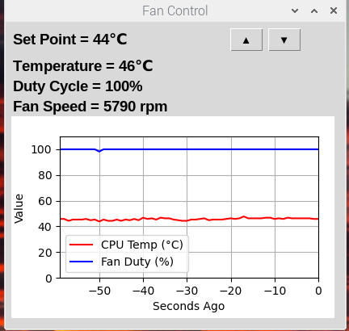

# RPiCpuFanControl

A Raspberry Pi CPU fan controller with a real-time GUI. It reads the CPU temperature, drives a PWM fan via GPIO, and displays live temperature, duty cycle, and RPM — along with a rolling 60-second chart.



## How it works

Two threads run concurrently:

- **Control loop** — runs every second, reads CPU temperature via `gpiozero`, computes a new duty cycle using a PID controller, writes the PWM signal to GPIO 18, and counts tachometer pulses on GPIO 17 to calculate RPM.
- **GUI** — Tkinter window showing current temperature, duty cycle %, RPM, and a live Matplotlib chart. Up/Down buttons let you adjust the target setpoint, which is saved to `config.ini` immediately.

The PID gains are negative so that a rising temperature increases fan speed (reverse-acting controller).

## Hardware

| Signal      | GPIO (BCM) |
|-------------|-----------|
| Fan PWM out | 18        |
| Tach input  | 17        |

PWM frequency: 1 kHz

## Dependencies

```bash
pip3 install matplotlib simple-pid gpiozero
```

`pigpiod` is required as the GPIO backend (supports kernel 6.x, unlike `RPi.GPIO`):

```bash
sudo apt-get install -y pigpiod
sudo systemctl enable pigpiod
sudo systemctl start pigpiod
```

## Configuration

`config.ini` (read from `/usr/local/projects/RPiCpuFanControl/config.ini` at runtime):

```ini
[configuration]
set_point = 44   # target CPU temperature in °C
kp = 5.0
ki = 0.5
kd = 0.5
```

The setpoint can also be adjusted live in the GUI.

## Installation

```bash
cd ~/git
gh repo clone cvmccoy1/RPiCpuFanControl
cd RPiCpuFanControl

# Copy application files
sudo mkdir -p /usr/local/projects/RPiCpuFanControl
sudo chmod 777 /usr/local/projects/
sudo cp ./*.py /usr/local/projects/RPiCpuFanControl/
sudo cp ./config.ini /usr/local/projects/RPiCpuFanControl/

# Desktop icon
sudo cp ./images/fan*.png /usr/share/pixmaps/
sudo cp ./scripts/fan.desktop /home/pi/Desktop/
```

## Autostart

Because this is a GUI app, it autostarts via the desktop session rather than a systemd service (which runs before a display is available). Copy the desktop shortcut to the autostart folder:

```bash
mkdir -p ~/.config/autostart
cp /home/pi/Desktop/fan.desktop ~/.config/autostart/
```

The app will launch automatically each time the Pi desktop loads.

## Running manually

```bash
python3 /usr/local/projects/RPiCpuFanControl/fanController.py
```
